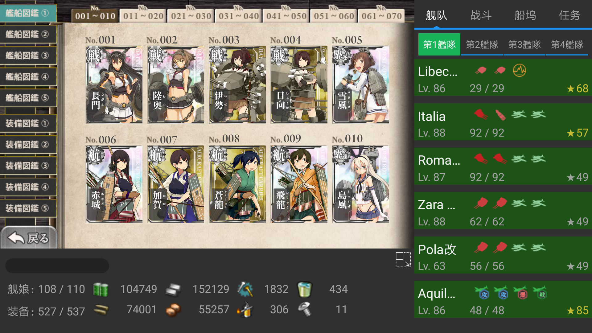
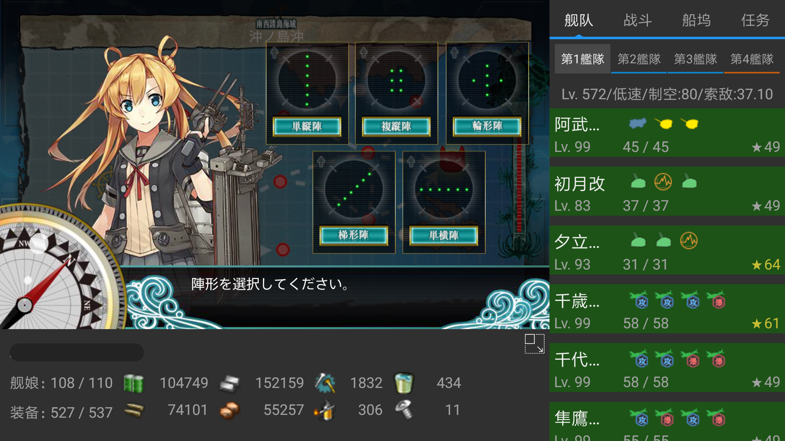
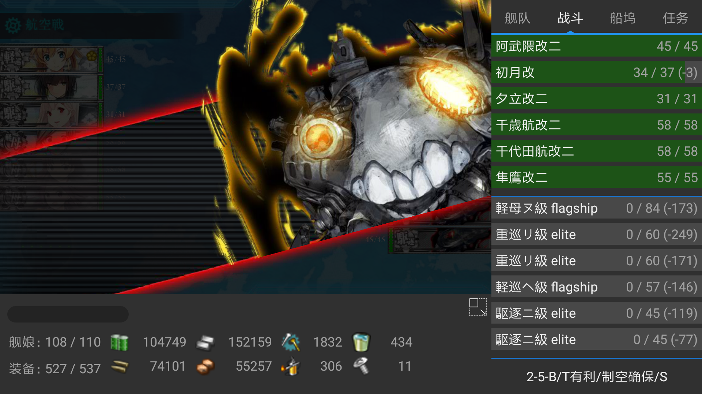
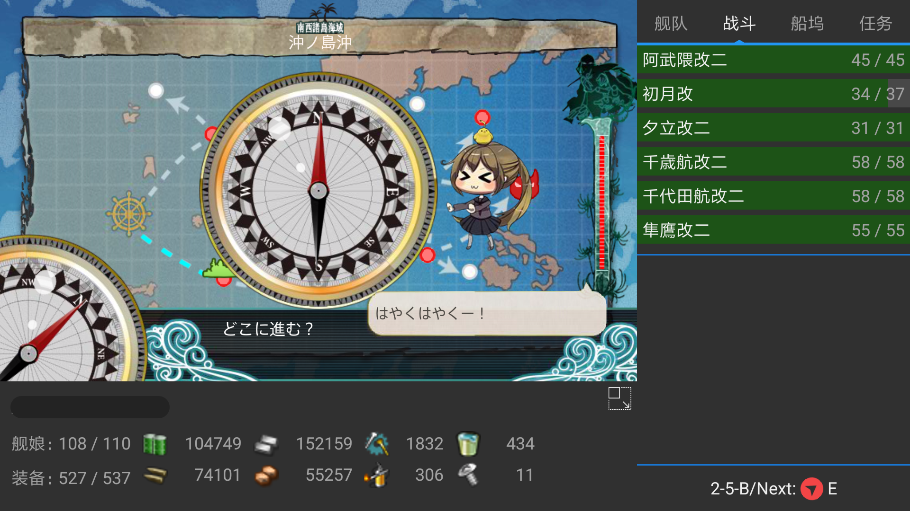
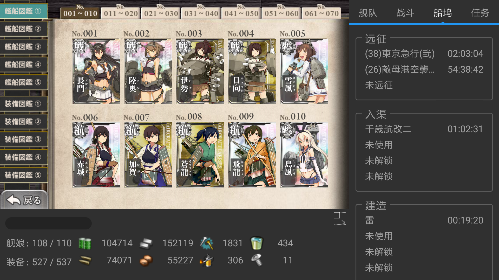
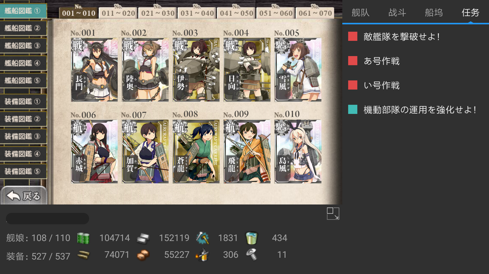

# KanColleCommand
便携式舰队司令部

## Notice

1. api适配目前还未完成，可能出现某些情况数据错误的情况，请不要过分依赖工具。
2. 底层代理与kcanotify相同使用了[NetGuard](https://github.com/M66B/NetGuard)，所以缺点也一样，无法使用VPN(例如锅Go)只能直连。可以在打开游戏前先挂上VPN以通过DMM的认证流程，游戏启动后会自动顶掉VPN。
3. 如果你有时间，发现问题可以提个issue。但这个人极懒，真的不知道什么时候会修好。

## Screenshots

## TODO

* Features
	* 舰娘详细面板
	* 联合舰队支持
	* 活动api支持
	* 多语言支持
	* ~~面板隐藏~~
	* ~~战斗路径点支持，罗盘方向支持~~
* Modules(卫星上天)
	* 舰娘信息
	* 装备信息
	* 战斗日志
	* ~~任务信息~~
	* etc..

## Thanks
* [poi](https://github.com/poooi/poi) - Scalable KanColle browser and tool.
* [kcanotify](https://github.com/antest1/kcanotify) - Viewer Application for KanColle Android

## Copyright
	This program is free software: you can redistribute it and/or modify   
	it under the terms of the GNU Lesser General Public License as   
	published by the Free Software Foundation, either version 3 of the 
	License, or (at your option) any later version.
	
	This program is distributed in the hope that it will be useful,   
	but WITHOUT ANY WARRANTY; without even the implied warranty of   
	MERCHANTABILITY or FITNESS FOR A PARTICULAR PURPOSE.  See the   
	GNU Lesser General Public License for more details.
	
	You should have received a copy of the GNU Lesser General Public 
	License along with this program.  If not, see <http://www.gnu.org/licenses/>.